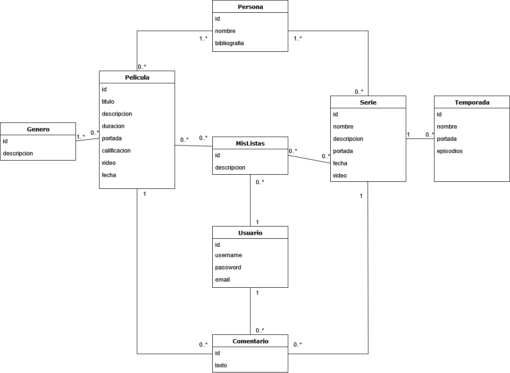

# NOMBRE_DEL_PROYECTO

Este es un archivo que debe completarse con los datos utilizados en el TPI. Este archivo puede modificarse en el tiempo, no obstante siempre debe mantenerse en un estado consistente con el desarrollo.

**Importante:** Este archivo debe mantenerse en formato Markdown (.md) y sólo se tendrá en cuenta la versión disponible en GIT.

## Descripción del proyecto

El proyecto consta de una aplicación web orientada a una red social de cine, en la cual, el usuario podrá crear listas personalizadas y agregar a estas películas y series según quiera, además, podrá realizar comentarios para compartir su opinión acerca de dichos entretenimientos. El usuario también podrá visualizar el detalle de las películas, series y personas, que consiste en portada, descripción, créditos, trailers y demás.
Se visualizarán distintas listas como populares, próximos estrenos, ranking, etc.
La aplicación será desarrollada en Python y los datos de las películas/series/personas serán obtenidos por medio de la API de TMDB a través de una clave que nos proporcionó dicha web.

## Modelo de Dominio

## Bosquejo de Arquitectura

## Reglas de Negocio

|RN|Descripción|
|01|La longitud de las contraseñas debe ser entre 8 y 16 caracteres y solo contienen letras y números.|
|02|El nombre de usuario debe ser único.|
|03|El email debe ser único.|
|04|El nombre de usuario debe contener entre 6 y 30 caracteres y no puede contener símbolos.|
|05|Los usuarios no autenticados no pueden realizar comentarios.|
|06|Los usuarios no autenticados no pueden crear listas personalizadas.|
|07|Los usuarios no autenticados no pueden agregar películas/series a las listas.|
|08|La información de las películas/series/personas se obtienen del api de TMDB.|

## Requerimientos

Definir los requerimientos del sistema.

### Funcionales

Listado y descripción breve de los requerimientos funcionales.

|REQ|Descripción|
|:---:|:---|
|01|Registrar nuevo usuario|
|02|Autenticar usuario|
|03|Cambiar contraseña de usuario|
|04|Mostrar listado de películas/series/personas populares|
|05|Mostrar listado de películas/series más valoradas|
|06|Mostrar listado de próximos estrenos de películas|
|07|Mostrar detalle de películas/series/personas|
|08|Mostrar tendencias de películas|
|09|Mostrar películas filtradas por género|
|10|Registrar nuevo comentario para una película/serie|
|11|Crear listas personalizadas|
|12|Agregar películas/series a lista personalizada|
|13|Visualizar recomendaciones según película/serie|

### No Funcionales

Listado y descripción breve de los requerimientos no funcionales. Utilizar las categorias dadas:

### Portability

**Obligatorios**

- El sistema debe funcionar correctamente en múltiples navegadores (Sólo Web).
- El sistema debe ejecutarse desde un único archivo .py llamado app.py (Sólo Escritorio).

### Security

**Obligatorios**

- Todas las contraseñas deben guardarse con encriptado criptográfico (SHA o equivalente).
- Todas los Tokens / API Keys o similares no deben exponerse de manera pública.

### Maintainability

**Obligatorios**

- El sistema debe diseñarse con la arquitectura en 3 capas. (Ver [checklist_capas.md](checklist_capas.md))
- El sistema debe utilizar control de versiones mediante GIT.
- El sistema debe estar programado en Python 3.8 o superior.

### Reliability

### Scalability

**Obligatorios**

- El sistema debe funcionar desde una ventana normal y una de incógnito de manera independiente (Sólo Web).
  - Aclaración: No se debe guardar el usuario en una variable local, deben usarse Tokens, Cookies o similares.

### Performance

**Obligatorios**

- El sistema debe funcionar en un equipo hogareño estándar.

### Reusability

### Flexibility

**Obligatorios**

- El sistema debe utilizar una base de datos SQL o NoSQL

## Stack Tecnológico

Definir que tecnologías se van a utilizar en cada capa y una breve descripción sobre por qué se escogió esa tecnologia.

### Capa de Datos

- SQLITE3
- SQLALCHEMY 1.4.7

Se utilizó una base de datos sqlite3 y como ORM se utilizó sqlalchemy para manejar la base de datos debido a las facilidades que nos brinda esta herramienta y otro motivo fue para aprender nuevas tecnologías.

### Capa de Negocio

Para obtener la información de las películas, consumimos la API de TMDB, la cual es una API pública. Para realizar las consultas se necesita una "api key", la cual solicitamos y utilizamos

### Capa de Presentación

- Flask.
- HTML5.
- BOOTSTRAP4.
- CSS3.

Optamos por la utilización de Flask para la capa de presentación debido a nuestra falta de experiencia con python necesitabamos un framework con una curva de aprendizaje baja. También, gracias a que Flask utiliza Jinja2 para el manejo de datos en las plantillas HTML, nos facilita mostrar la información en la web.
Al ser inexpertos en el frontend, creemos que lo mejor es utilizar clases bootrstrap para la estética de la web y refinar cosas puntuales con nuestro escaso conocimiento de css.